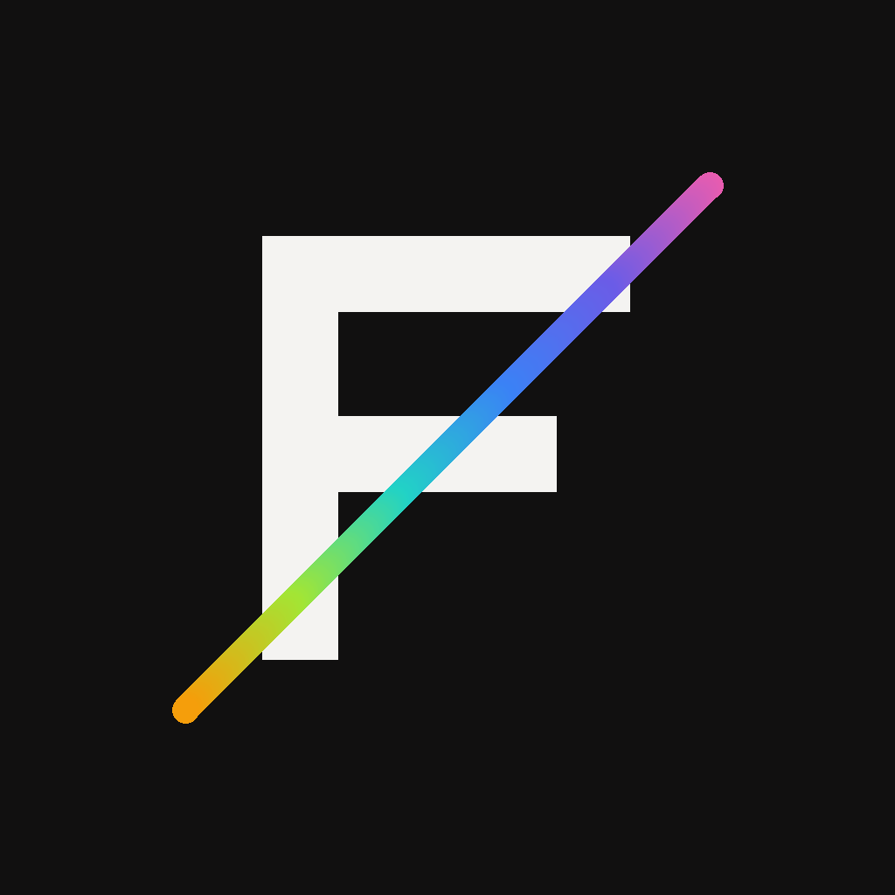
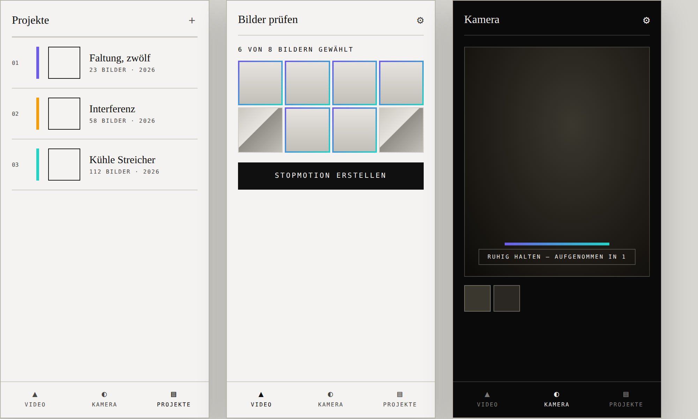
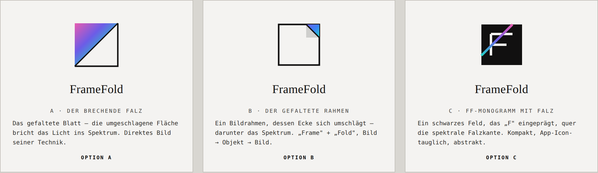

<div align="center">



# FrameFold

**Turn a video of your working process into an automatic stop-motion — entirely on your iPhone.**

[](https://github.com/RainerBracharz/framefold/actions/workflows/ios-build.yml)
&nbsp;·&nbsp; SwiftUI &nbsp;·&nbsp; On-device computer vision &nbsp;·&nbsp; iOS 17+

</div>

---

FrameFold records a working process on video and condenses it into a stop-motion animation on its own: it finds the calm moments, drops every frame where hands are in the shot, stabilises hand-held footage, and assembles the result — all locally, nothing leaves the device.

It was built as a **bespoke tool for the Austrian artist [Aldo Tolino](https://www.aldotolino.com/)**, whose practice folds printed photographs into sculptural objects and photographs them again — *“every image can be printed, therefore folded; a folded object can be photographed and become an image again — an endless loop between image and object.”* FrameFold is an instrument inside that loop: its whole design and language are drawn from his work.

<div align="center">

</div>

## What it does

- **Video → stop-motion, automatically.** Samples the footage, scores motion and sharpness, and keeps one clean frame per “rest” moment.
- **Hands removed.** Frames with visible hands are discarded via Apple’s Vision hand-pose detection (with an optional path to a custom-trained RF-DETR CoreML model).
- **Auto-shutter camera.** Put the phone on a tripod or hold it over the work; it captures a frame by itself whenever your hands leave the frame and the scene settles — with a live motion gauge, spirit level, thirds grid, haptic shutter and onion-skin overlay.
- **Review before render.** Every candidate frame shown as a contact sheet; deselect with a tap, play the selection as a live loop before committing.
- **Hand-held stabilisation.** Each frame is aligned to a fixed reference (verified block-matching) so free-hand footage sits still.
- **Projects & archive.** Works organised in series, collected across many sessions, with a 30-day trash and a print-ready contact-sheet PDF.
- **Private by design.** All processing is on-device. No account, no upload, no server.

## How it works

```
Video ─▶ sample ~6 fps ─▶ motion + sharpness scoring ─▶ Otsu “rest” detection
      ─▶ hand removal (Vision / RF-DETR) ─▶ dedup ─▶ review ─▶ stabilise ─▶ assemble (AVAssetWriter)
```

The signal-processing core (rest detection, sharpness, perceptual hashing, crop geometry, shift estimation) is isolated in a single dependency-free file and covered by **60+ tests that run on every push**, so the maths is verified independently of the Apple frameworks.

## Design

Strictly monochrome — a quiet **gallery** for viewing and a **darkroom** for capture — with colour entering only where light breaks in Tolino’s folds: the logo, the active selection, the progress and level indicators. Each project carries its own spectral accent drawn from the work. Typography pairs **New York** (serif, the catalogue voice) with **SF Mono** (the annotation-on-the-back-of-a-print voice).

<div align="center">

</div>

## Engineering

| | |
|---|---|
| **UI** | SwiftUI (iOS 17+) |
| **Vision / capture** | AVFoundation, Vision, CoreMotion, Core Image |
| **On-device ML** | Apple Vision hand-pose; CoreML-ready for a custom RF-DETR model |
| **Persistence** | File-based projects with JSON manifests |
| **CI/CD** | GitHub Actions on macOS — builds the app and runs the test suite on every commit |
| **Tests** | 60+ unit tests on the pure algorithmic core |

## Build & run

1. Download the repository (green **Code → Download ZIP**) and open `FrameFold.xcodeproj`.
2. Select your Team under **Signing & Capabilities** (a free Apple ID is enough).
3. Connect an iPhone, hit **⌘R**.

## Credits

Designed and built by **[Bracharz Consulting](https://www.bracharz.com)** — Rainer Bracharz, Certified Digital Consultant — as a bespoke commission for artist **[Aldo Tolino](https://www.aldotolino.com/)**. Developed rapidly with AI-assisted engineering and a fully automated build-and-verify pipeline.

*Status: beta, in active development.*

---

© 2026 Bracharz Consulting. All rights reserved. Artwork and process shown belong to Aldo Tolino.
