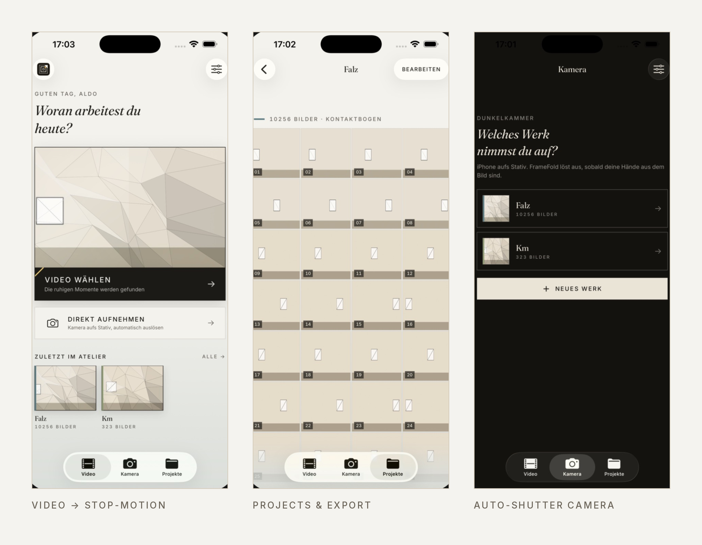
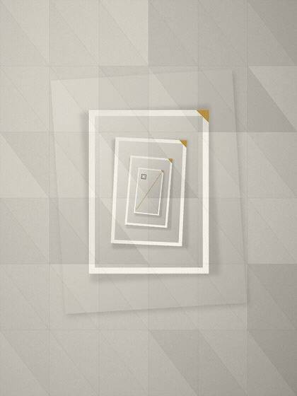

<div align="center">


# FrameFold

**Film yourself working. Get a stop-motion back. Nothing leaves the phone.**

[](https://apps.apple.com/at/app/framefold/id6801045603)

[](https://github.com/RainerBracharz/framefold/actions/workflows/ios-build.yml)
&nbsp;·&nbsp; **Version 1.0 — live on the App Store** &nbsp;·&nbsp; SwiftUI &nbsp;·&nbsp; On-device computer vision &nbsp;·&nbsp; iOS 17+

</div>

<div align="center">

</div>

<div align="center">

<br/><sub><em>This demo was made with FrameFold. What else.<br/>Keyframe selection, facet transitions, paper relief and image echo — all rendered by the app's own pipeline.</em></sub>
</div>

---

## I built an app almost nobody needs. On purpose.

The audience is visual artists, craftspeople and art teachers. It is a market no
large company will ever serve, because the numbers don't work. That is precisely
what makes it interesting.

The occasion was one person. The Austrian artist
**[Aldo Tolino](https://www.aldotolino.com/)** folds printed photographs into
objects and photographs them again — image becomes object becomes image. He
wanted to document that process without constantly interrupting it. No shutter
release, no assistant, no hundred frames shot by hand.

So this became a tool that finds the calm moments in a video by itself. It drops
every frame with his hands in the shot, compensates for camera shake, and
assembles the rest into an animation. All on the device, no cloud, no account.

A commission for one person turned into a public product — and the story behind
that decision is written up here:
**[Eigene App als Marketinginstrument](https://www.bracharz.com/nischen-app-marketing/)**.

## What it does

- **Video → stop-motion, automatically.** Samples the footage, scores motion and
  sharpness, keeps one clean frame per moment of rest.
- **Hands removed.** Frames with visible hands are discarded via Apple's Vision
  hand-pose detection (with an optional path to a custom-trained RF-DETR CoreML
  model).
- **Auto-shutter camera.** Put the phone on a tripod and work. It fires by itself
  whenever your hands leave the frame and the scene settles, then **locks
  exposure, focus and white balance** so nothing drifts between frames, and snaps
  the shutter speed to the mains frequency against LED flicker. Tap-to-focus, an
  interval trigger, a live motion gauge, spirit level, thirds grid and haptic
  shutter are all there.
- **Onion skin and drift check.** Overlay the previous frame — or the very first
  frame of the session — at adjustable opacity, plus an optional external
  reference image. The screen stays awake for the whole session.
- **Review before you commit.** Every candidate frame as a contact sheet.
  Deselect with a tap, adjust the yield with one slider, play the selection as a
  live loop.
- **A result like an edition.** A session ends in a catalogue-style card —
  *"Blatt 01 – 24 · Serie von 24 · datiert 2026"* — with the finished loop, ready
  to share, keep as a project or refold.
- **Hand-held stabilisation.** Each frame is aligned to a fixed reference
  (verified block-matching), so free-hand footage sits still.
- **Works, not files.** Projects collect frames across many sessions, with a
  30-day trash, a print-ready contact-sheet PDF and a fold-template PDF.
- **Exhibition reel.** Several works assembled into one continuous reel with
  catalogue title cards.
- **Private by design.** Everything happens on the device. No account, no upload,
  no server, no network requests at all.

## Three modes

A three-card onboarding on first launch explains the two ways of working — pick a
video or record live — and lets you choose a mode. It can be changed at any time.

| Mode | For |
|---|---|
| **Simple** | Pick a video, get a stop-motion. Nothing else on screen. Playful enough for Tolino's students: big counter, warm language, instant result. |
| **Advanced** | Frame rate, aspect, resolution, playback mode, stabilisation. |
| **Aldo Tolino** | Everything, plus the studio effects below. |

**The Tolino stage:** *print look* (black and white on a warm paper tone), *paper
relief* (each facet catching the light differently, as if the image had been
folded and re-photographed), *image echo* (each frame lingering in the next, a
recursion of its own image), and fold transitions in three styles — **crease**,
**facets** and **weave**, the last drawn from his woven paper works.

## How it works

```
Video ─▶ sample ~10 fps ─▶ motion + sharpness scoring ─▶ Otsu rest detection
      ─▶ hand removal (Vision / RF-DETR) ─▶ dedup ─▶ review ─▶ stabilise
      ─▶ assemble (AVAssetWriter)
```

The signal-processing core — rest detection, sharpness, perceptual hashing, crop
geometry, shift estimation — sits in a single dependency-free file and is covered
by **60+ tests that run on every push**. The maths is verified independently of
the Apple frameworks, which is the part that actually breaks.

## Design — "Crack & Light"

The visual language comes from Tolino's 2024 series (*Full-Blown*, *Cracked*, the
reliefs): crushed white paper on luminous gradient fields, colour glowing
*through* the sheet, and amber as his recurring signal. The gallery is a light
wall with a soft vertical gradient; the darkroom stays warm for capture.

The home screen doesn't describe folding, it **crumples**: an irregular fractured
paper field, filled with the frames of your latest work, hung with a soft shadow
like a print on a wall. **Tilt the phone and the light travels across the
facets** — as if you were turning the print under gallery light. Image, object,
image, made physical. The finished animation is presented like one of his
editions: sealed under acrylic glass, with a gloss, a shadow and an edition line.

Typography pairs **Fraunces** (serif, with the italic as the speaking voice, as
on his website) with **Inter** (the annotation-on-the-back-of-a-print voice).
Selection is marked by inversion, an ink block, never by colour.

**The mark** is not a letter. A sheet whose folded corner contains a sheet, whose
folded corner contains a sheet — the endless loop drawn as a figure, with amber
marking the layer you currently stand on. The concentric squares nod to Albers,
whom Tolino cites directly when he asks whether the surface itself can generate
images.

## Engineering

| | |
|---|---|
| **UI** | SwiftUI (iOS 17+) |
| **Vision / capture** | AVFoundation, Vision, CoreMotion, Core Image |
| **On-device ML** | Apple Vision hand-pose; CoreML-ready for a custom RF-DETR model |
| **Persistence** | File-based projects with JSON manifests |
| **CI/CD** | GitHub Actions on macOS — builds and runs the test suite on every commit |
| **Tests** | 60+ unit tests on the pure algorithmic core |
| **Dependencies** | None. No third-party SDK, no analytics, no crash reporting |

## Build and run

1. Download the repository (green **Code → Download ZIP**) and open
   `FrameFold.xcodeproj`.
2. Select your Team under **Signing & Capabilities** (a free Apple ID is enough).
3. Connect an iPhone and hit **⌘R**.

Or simply
[install it from the App Store](https://apps.apple.com/at/app/framefold/id6801045603) —
it's free.

## Why this repository is public

Because a claim is worth less than something you can check. The app is in the
store, it passed Apple's review, and the unglamorous parts are done too:
[privacy policy](https://www.bracharz.com/framefold-datenschutz/), EU trader
status, store compliance. The code is here so you can see how it was built,
including the parts that took three attempts.

Built by **[Bracharz Consulting](https://www.bracharz.com)** — Rainer Bracharz,
Certified Digital Consultant — as a commission for artist
**[Aldo Tolino](https://www.aldotolino.com/)**. Developed AI-assisted, in weeks
rather than months, with an automated build-and-verify pipeline. The whole
reasoning behind doing this at all is on
[bracharz.com](https://www.bracharz.com/nischen-app-marketing/).

Typefaces: [Fraunces](https://github.com/undercasetype/Fraunces) and
[Inter](https://github.com/rsms/inter), both under the SIL Open Font License
(see `FrameFold/Fonts-Licenses/`).

---

© 2026 Bracharz Consulting. Artwork and process shown belong to Aldo Tolino.
